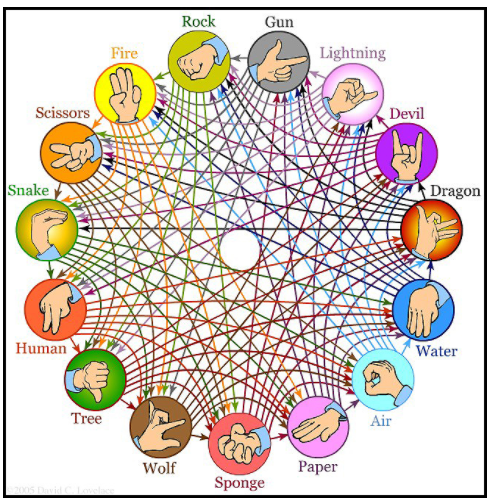

# Rock, paper and scissors

A playable Rock-Paper-Scissors game, with a Player vs Computer mode. Practice using arrays, the Random library, formatted strings, and algorithms.

### Types of game
1.  paper,scissors,rock (default, when you leave blank)
2.  [rock,paper,scissors,lizard,spock](https://www.youtube.com/watch?v=x5Q6-wMx-K8)
3. rock,gun,lightning,devil,dragon,water,air,paper,sponge,wolf,tree,human,snake,scissors,fire

### Commands
!exit - to exit
!rating - to chcek your score (win - 100, draw - 50, lose - 0 points)
